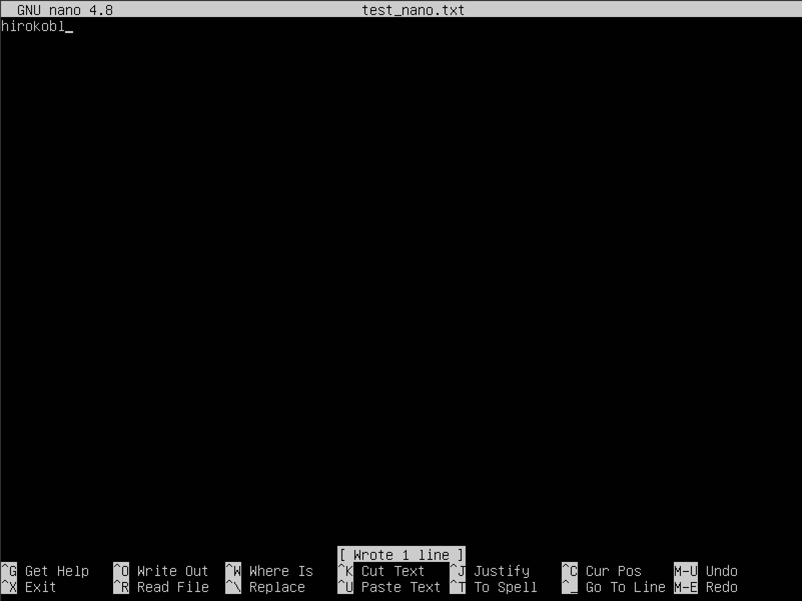
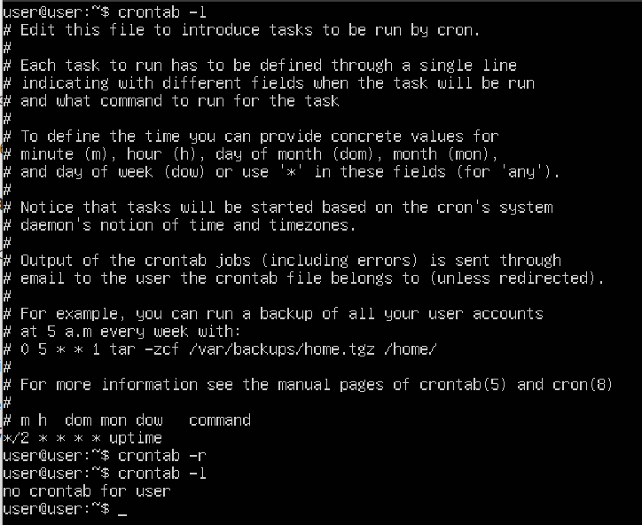

## Part 1. Установка ОС

- Вывел версию Ubuntu: ***Ububtu 20.04.06 LTS \n \l***.

## Part 2. Создание пользователя

- Создал нового пользователя ***userADM***.

- Новый пользователь находится в группe ***adm*** при выводе команды.

## Part 3. Настройка сети ОС

- Задал название машины вида ***user-1***.

- Установиk временную зону ***Europe/Moscow***.

- Вывел названия сетевых интерфейсов.

> lo (loopback device) – виртуальный интерфейс, присутствующий по умолчанию в любом Linux. Он используется для отладки сетевых программ и запуска серверных приложений на локальной машине. С этим интерфейсом всегда связан адрес 127.0.0.1. У него есть dns-имя – localhost. Посмотреть привязку можно в файле /etc/hosts.

- Получил ip адрес устройства, на котором работаю.

> DHCP (Dynamic Host Configuration Protocol) - сервер, предоставляющий IP-адреса и другие сетевые параметры клиентам в сети. Это позволяет устройствам автоматически получать и обновлять IP-адреса.

- Вывел на экран внешний (ip) и внутренний (gw) IP-адрес шлюза.

- Задал статичные настройки ip, gw, dns, используя публичный DNS серверы, например 1.1.1.1 или 8.8.8.8.

- Принимял все изменения и перезапустил систему.

- Проверил настройки после перезапуска системы на соответствие заданным до этого.

- Пропинговал удаленные хосты 1.1.1.1 и ya.ru.

## Part 4. Обновление ОС

- Обновил все системные пакеты до последней на момент выполнения задания версии.

## Part 5. Использование команды sudo

> sudo - команда, которая позволяет вам запускать программы от имени других пользователей, а также от имени суперпользователя.

- Поменял hostname ОС от имени пользователя, созданного в пункте Part 2, на ***userADM2***.

## Part 6. Установка и настройка службы времени

- Вывел время часового пояса, в котором я сейчас нахожусь так, чтобы вывод содержал NTPSynchronized=yes.

> NTPSynchronized=yes — это параметр, который показывает, синхронизировано ли системное время с NTP (Network Time Protocol) сервером.

## Part 7. Установка и использование текстовых редакторов

- Установил текстовые редакторы VIM, NANO, NEOVIM.

- Создал файл test_vim.txt. Написал в нём свой никнейм и закрыл с сохранением изменений.

> Для выхода с сохранением изменений нужно нажать `esc`, затем написать `:x`

- Создал файл test_nano.txt. Написал в нём свой никнейм и закрыл с сохранением изменений.

> Для выхода с сохранением изменений нужно нажать `control + S` и затем `Y`

- Создал файл test_neovim.txt. Написал в нём свой никнейм и закрыл с сохранением изменений.

> Для выхода с сохранением изменений нужно нажать `esc`, затем написать `:wq`

- Отредактировал файл test_vim.txt. Заменил никнейм на строку «21 School 21» и закрыл без сохранения изменений.

> Для выхода без сохранения изменений нужно нажать `esc`, затем написать `:q!`

- Отредактировал файл test_nano.txt. Заменил никнейм на строку «21 School 21» и закрыл без сохранения изменений.

> Для выхода без сохранения изменений нужно нажать `control + X` и затем `N`

- Отредактировал файл test_neovim.txt. Заменил никнейм на строку «21 School 21» и закрыл без сохранения изменений.

> Для выхода без сохранения изменений нужно нажать `esc`, затем написать `:q!`

- Отредактировал файл test_vim.txt. Провел поиск по содержимому файла и заменил слово на любое другое.

> Поиск осуществляется через команду :`/"слово для поиска"`

> Замена найденого слова осуществляется через команду : `:s /"слово для замены"/"слово на которое мы хотим заменить"`

- Отредактировал файл test_nano.txt. Провел поиск по содержимому файла и заменил слово на любое другое.

> Поиск осуществляется через : `Ctrl + W`

> Замена осуществляется через `Ctrl + \`

- Отредактировал файл test_neovim.txt. Провел поиск по содержимому файла и заменил слово на любое другое.

> Поиск осуществляется через команду :`/"слово для поиска"`

> Замена найденого слова осуществляется через команду : `:s /"слово для замены"/"слово на которое мы хотим заменить"`

## Part 8. Установка и базовая настройка сервиса SSHD

- Установи службу SSHd.

- Добавил автостарт службы при загрузке системы.

- Перенастроил службу SSHd спорта 22: на порт 2022.

- Используя команду ps, показал наличие процесса sshd. Для этого к команде нужно подобрать ключи.

- Перезапустил сервер, используя  команду `sudo systemctl restart ssh`, чтобы изменения в конфигурации сохранились.

- Вывод команды netstat -tan.

> `netstat -tan`:
  > \
  > Команда `netstat` показывает статистику приема и отправки пакетов, а также информацию об ошибках приема и отправки.
  > `-a` - Вывод всех активных подключений TCP и прослушиваемых компьютером портов TCP и UDP.\
  > `-n` - Вывод активных подключений TCP с отображением адресов и номеров портов в числовом формате без попыток определения имен.\
  > Тогда, если `netstat -na` - просмотр всех открытых протоколов, то `netstat -tan` - просмотр всех открытых ТСР-протоколов.\
  > \
  > При вызове команды в терминал выводится таблица, столбцы которой имеют следующие значения:\
  > `Proto` - сетевой протокол (tcp, udp);\
  > `Recv-Q` - количество байтов, помещённых в буфер приёма TCP/IP, но не переданных приложению. Если это число высокое, то нужно проверить работоспособность приложения, которое работает с данным портом.\
  > `Send-Q` — количество байтов, помещённых в буфер отправки TCP/IP, но не отправленных, или отправленных, но не подтверждённых. Высокое значение может быть связано с перегрузкой сети сервера.\
  > `Local Address` — локальный адрес сервера. В обычных соединениях, это адрес сервера на который пришло соединение. В прослушиваемых портах (LISTEN) — это диапазон адресов. Так 0.0.0.0:port — значит подключаться можно ко всем адресам сервера, а 192.168.0.35:port — значит подключаться можно только к этому адресу сервера.\
  > `Foreign Address` — адрес второй стороны. В обычных соединениях, это адрес с которого пришло соединение. В прослушиваемых портах (LISTEN) — это диапазон адресов. 0.0.0.0 — значит подключаться можно с любых адресов и с любых портов, а например 192.168.2.1 - значит подключаться можно только с этого адреса и с любых портов.\
  > `State` - состояние подключения, или прослушивания.

## Part 9. Установка и использование утилит top, htop

- При вводе команды `top` выводится следующее:

> uptime - 28
> количество авторизованных пользователей - 1
> общую загрузку системы - 0.00
> общее количество процессов - 96
> загрузку cpu - 0.0
> загрузку памяти - 150,2 и 1971.6
> pid процесса занимающего больше всего памяти - 1
> pid процесса, занимающего больше всего процессорного времени - 9

- При вводе команды `htop` выводится следующее :
 

 

- Для сортировки в `htop` нужно нажать `F6` и выбрать нужный параметр.

> Сортировка по `PID`.

> Cортировка по `PERCENT_CPU`.

> Сортировка по `PERCENT_MEM`.

> Сортировка по `TIME`.

- Для использования фильтров нужно нажать F4.

> Фильтр процесса SSHd.

> Чтобы найти процесс `syslog` я воспользовался функцией поиска на `F3`.

> Вывод с добавленными параметрами hostname, clock и uptime.

## Part 10. Использование утилиты fdisk

- Запустил команду `fdisk -l`.

> Название жесткого диска VBOX HARDDISK.
>Размер 25 GiB.
>Количество секторов 52428800.

- Узнал, что размер swap составляет 2,0Gi.

## Part 11. Использование утилиты df

- Запустил команду `df` для корневого раздела `/`.

> Размер раздела 11758760.
> Размер занятого пространства 5265016.
> Размер свободного пространства 5874636.
> Процент использования 48%.
> Единицей измерения являются килобайты.

- Запустил команду `df -Th` для корневого раздела `/`.

> Размер раздела 12G.
> Размер занятого пространства 5.1G.
> Размер свободного пространства 5.7G.
> Процент использования 48%.
> Единицей измерения являются гигабайты.

## Part 12. Использование утилиты du

- Запустил команду `du`.

- Вывел размер папок /home, /var, /var/log.

- Вывел размер всего содержимого в /var/log, используя *.

## Part 13. Установка и использование утилиты ncdu

- Установил утилиту  `ncdu`.

- Вывел размер папок /home.

- Вывел размер папок /var.

- Вывел размер папок /var/log.

## Part 14. Работа с системными журналами

- `/var/log/dmesg` — драйвера устройств. Содержит сообщения, полученные от ядра

- `/var/log/syslog`— содержит глобальный системный журнал, в котором пишутся сообщения с момента запуска системы, от ядра Linux, различных служб, обнаруженных устройствах, сетевых интерфейсов и много другого

- `/var/log/auth.log` — информация об авторизации пользователей, включая удачные и неудачные попытки входа в систему, а также задействованные механизмы аутентификации.

> Время последней успешной авторизации : Jul 3, 10:17:01
> Имя пользователя: user
> Метод входа в систему: uid = 0

- Перезапустил службу SSHd и проверил изменения в журнале.

## Part 15. Использование планировщика заданий CRON

- Используя планировщик заданий, запустил команду uptime через каждые 2 минуты.

- Нашел в системных процессах выполнение `uptime`:

- Удалил все задания из планировщика заданий.

